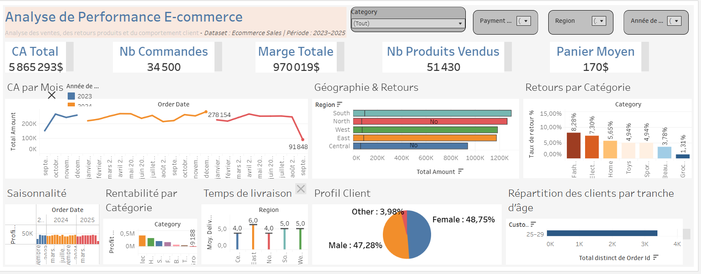

# 📊 Analyse de Performance E-commerce (Tableau)

## 🔍 Overview
Ce projet présente un dashboard interactif conçu avec Tableau Public afin d’analyser la performance d’un e-commerce entre 2023 et 2025.

L’objectif est d’identifier les tendances de ventes, la rentabilité des produits, le comportement client ainsi que les performances logistiques.

## 🔗 Dashboard interactif
👉 https://public.tableau.com/views/ecommerce-dashboard-tableau/AnalysedePerformanceE-commerce

## 📊 Aperçu

---

## 📌 Problématiques analysées

- Comment évolue le chiffre d’affaires dans le temps ?
- La croissance est-elle liée au volume ou au panier moyen ?
- Quelles catégories sont réellement rentables ?
- Quels segments clients génèrent le plus de valeur ?
- Existe-t-il des différences de performance selon les régions ?

---

## 📌 Key Insights

### 💰 Performance globale
La marge évolue proportionnellement au chiffre d’affaires, indiquant une structure de coûts stable.

### 🛒 Panier moyen vs volume
La croissance du chiffre d’affaires en 2024 est principalement due à une augmentation du volume de commandes, et non du panier moyen.

### 📦 Rentabilité produit
Certaines catégories, comme Electronics, sont très rentables, tandis que d’autres génèrent des pertes malgré un volume de ventes élevé.

### 👥 Comportement client
La tranche d’âge 25–29 ans est la plus active en termes de commandes, mais ce n’est pas la tranche la plus représentée en nombre de clients.

### 📅 Saisonnalité
Des pics de performance sont observés selon les périodes (ex : mai 2023, juillet 2024, octobre 2025), indiquant une forte saisonnalité.

### 🌍 Logistique
Les délais de livraison varient selon les régions, avec certaines zones présentant des délais plus longs, impactant potentiellement l’expérience client.

### 📦 Retours produits
Les taux de retour varient fortement selon les catégories, avec la catégorie Fashion en tête.

---

## 🛠️ Outils utilisés
- Tableau Public
- Data Visualization
- Analyse business

---

## 🎯 Compétences démontrées
- Construction de KPI
- Data storytelling
- Analyse de performance commerciale
- Analyse du comportement client
- Identification d’insights business

---

## 👩🏽‍💻 Auteur
Keliane Matene
